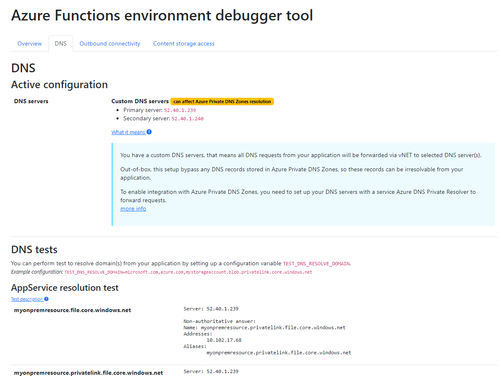

# Azure Functions Environment Debugger

## Description

This .NET tool is for Cloud Solution Architects and Cloud Engineers to debug Azure Functions applications, 
deployed in large complex (typically corporate) environments, with firewalls, network security groups, App Service Environments and other tool.

## License

The tool is released under the MIT License, see LICENSE file.

## Installation

You can install this debugger by setting up configuration variable to pre-compiled package on GitHub: 
`WEBSITE_RUN_FROM_PACKAGE = https://github.com/vjirovsky/azFuncDebugger/releases/download/v0.7/pre-release.zip`
 

Alternatively you can publish this codebase to given FunctionApp via Visual Studio (Code).

## Usage

Open a URL `https://<<hostname>>/RunTests`. All tests will be displayed on this page.

For tool configuration set following Configuration variables: 
- `TEST_DNS_RESOLVE_DOMAINS` = <em>`<<comma-delimited list of domains>>`</em> - performs resolutions of given domains via all available DNS servers 
<em>e.g. `TEST_DNS_RESOLVE_DOMAINS` = `azure.com,someonpremresource.contoso.internal,vjirovsky.cz` </em>

- `TEST_HTTPCLIENT_GET_URL` = <em>`<<url to test>>`</em> - performs HTTP request to given URL via same outbound connectivity configuration as the real application will use 
<em> e.g.  `TEST_DNS_RESOLVE_DOMAINS` = `https://vjirovsky.cz` </em>

### Content Storage Access Simulator

The tool/debugger has built-in simulator for testing access to content storage (in case the application doesn't use package deployment). 
You can test desired configuration with setting up follow variables:

- `TEST_CCONNECTIONSTRING` = `<<connection string as in WEBSITE_CONTENTAZUREFILECONNECTIONSTRING variable>>` 
<em>e.g. - `TEST_CCONNECTIONSTRING` = `DefaultEndpointsProtocol=https;AccountName=xyzmystorageaccount;AccountKey=xxxxxxxxxxxxxxxxxxxxxxxx;EndpointSuffix=core.windows.net` </em>
  
- `TEST_CSHARE` = `<<file share name as in WEBSITE_CONTENTSHARE variable>>` 
<em>e.g. - `TEST_CSHARE` = `myfilesharestorage` </em>

## Issues

Please report any issue into [GitHub issues](https://github.com/vjirovsky/azFuncDebugger/issues).
